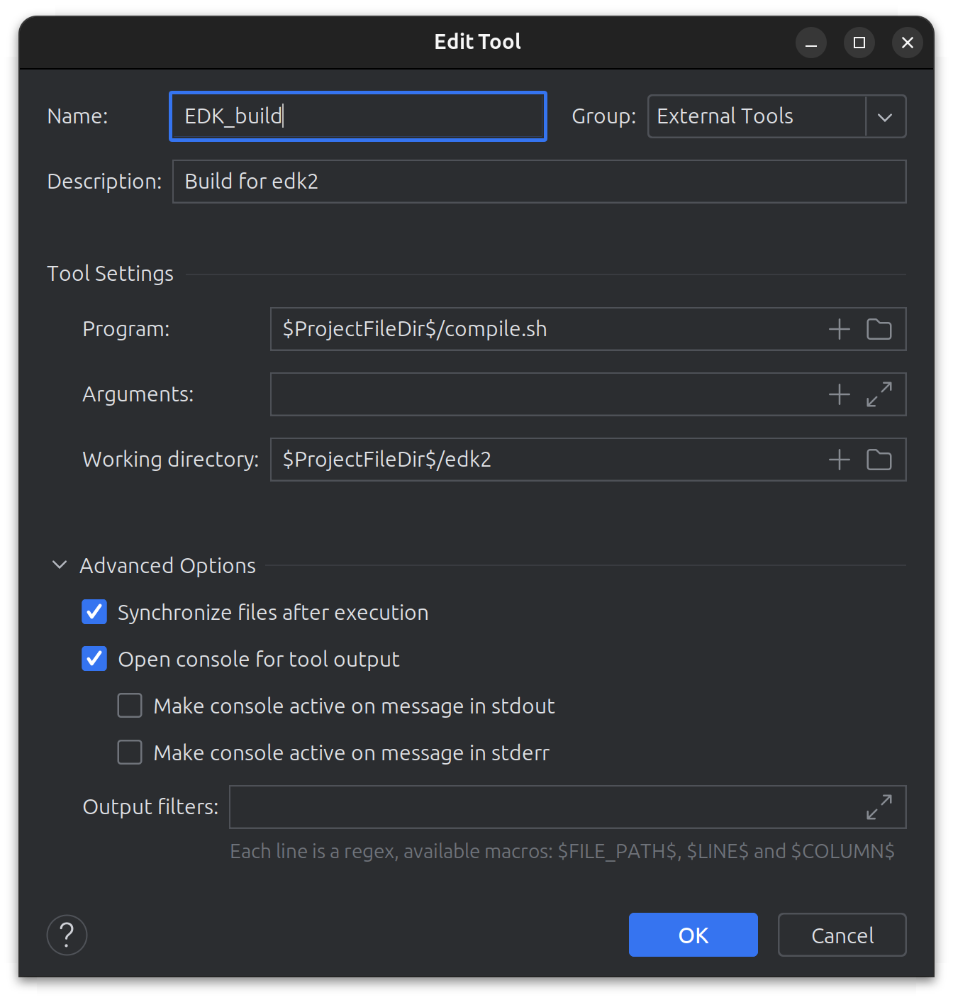

# uefi-tui <br>
# A simple port of ncurses to UEFI.
## Team members:
- [Pavlo Kryven](https://github.com/codefloww)
- [Anastasiia Shvets](https://github.com/shnasta)
- [Anna Polova](https://github.com/Annnnya)
- [Andrii Yaroshevych](https://pbs.twimg.com/media/F-bInKaWIAA2LoW?format=jpg&name=medium)
## Mentor:
- [Volodymyr Kuchynskiy](https://github.com/Centurion256)

## Prerequisites
* QEMU(in particular qemu-system-x86_64)
* GCC
* GNU Make
* Ubuntu 23.04(other versions may work, but not tested)

## Setup and first compilation
For setup and compilation refer to the [Setup EDK2](https://www.notion.so/Setup-EDK2-with-libc-ce84b1cd720045a8b4ff5e3b440af31c?pvs=4)
Commands for setup are in the `setup.sh` file.
> Note: Don't forget to change the `target.txt` files as described in the `Setup EDK2` guide.

> Note: You may also need to add:
> ```shell
> export WORKSPACE="$dir/../../../"
> export EDK_TOOLS_PATH="$dir/../../"
> export PACKAGES_PATH="$dir/../../../../edk2-libc:$dir/../../../"
> export PYTHONPATH="$dir/../../Source/Python${PYTHONPATH:+:"$PYTHONPATH"}"
> cmd=${full_cmd##*/}
> exec "${python_exe:-python3}" "$PROJECT_DIR$/edk2/BaseTools/Source/Python/$cmd/$cmd.py" "$@"
> ```
> to the `edk2/BaseTools/BinWrappers/PosixLike/build` file, in order to be able to use some of the Clion ready run configuration described below.

### Move the project internal files to the edk2-libc folder
- In order to compile our library and application, you need to move the `AppPkgReplacements/Snake` folder to the `edk2-libc/AppPkg/Applications` folder. <br>
- You also need to insert folders `Include` and `Library` from the `AppPkgReplacements` folder to the `edk2-libc/AppPkg` folder. <br>
- You have to replace the `edk2-libc/AppPkg/AppPkg.dsc` and `edk2-libc/AppPkg/AppPkg.dec` files with the ones from the `AppPkgReplacements` folder. <br>

Additionally, you can add the `setup.sh` script and `compile.sh` script into run/debug configuration in CLion. <br>
- For `setup.sh` Shell Script configuration should be used. Setup working directory as the root of the project. <br>
- For `compile.sh` Shell Script configuration should be used. Setup working directory as the edk2 folder in the root of the project. <br>
- To run qemu with already compiled and copied to the image application, you can use the configuration from the included .idea folder. <br>
However, you need to add external tool as follows: <br>

## Compilation
After running the `setup.sh` script, you can use `compile.sh` script to compile the application, and copy it to the image for qemu. <br>
> Note: You may need to change the `compile.sh` script to match your paths and packages.

## Running
You can use the `machine` configuration provided in the `.idea` folder, granted that you have already done everything in [Setup and first compilation](#setup-and-first-compilation) section. <br>
### In general case:
```shell
qemu-system-x86_64 -machine ubuntu \
-drive if=pflash,format=raw,readonly=on,file=ovmf.flash 
-drive format=raw,file=UefiShell.iso 
-drive file=app.disk,index=1,media=disk,format=raw
```
In UEFI Shell, navigate to the `fs1:` and run the `Snake.efi` executable.

## Link for other documentation
[Our notion page](https://remarkable-verbena-851.notion.site/Notes-de9cd6ff594d42aab022faede113fe0d)
